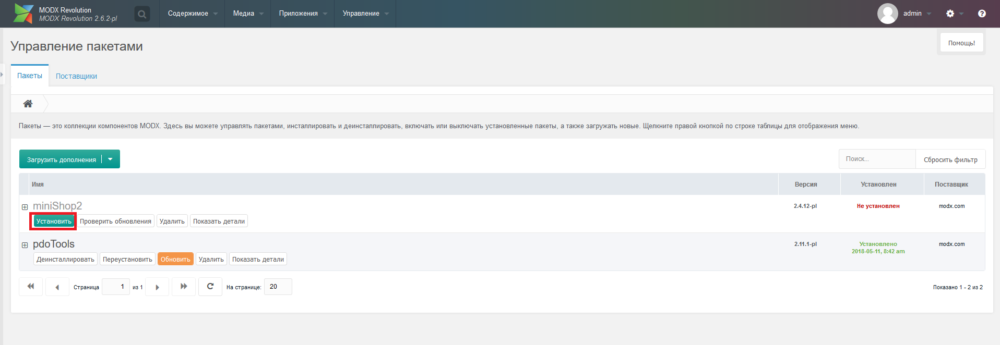
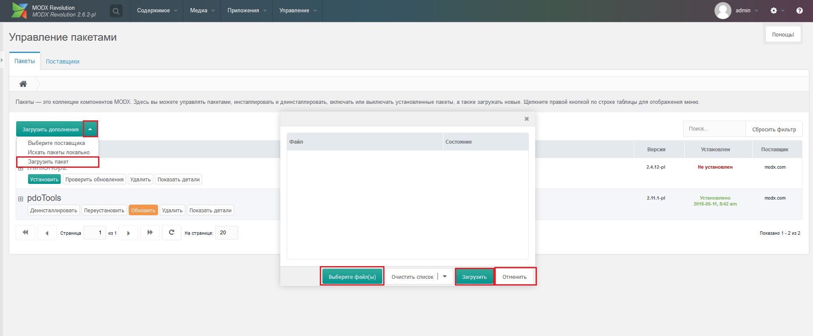
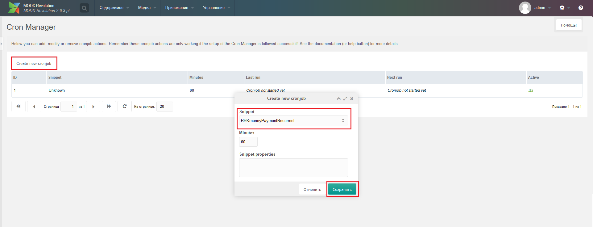
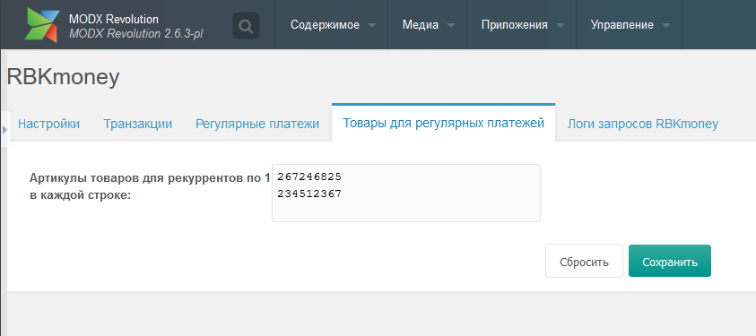
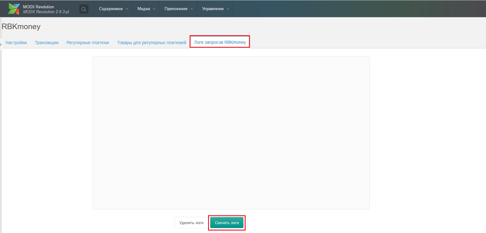

# rbkmoney-cms-modx

Пожалуйста, обязательно делайте бекапы!

Платежный модуль RBKmoney для MODX

Модуль разрабатывался и тестировался на MODX Revolution 2.6.3-pl, miniShop2 2.4.12-pl

#### Требования

- PHP 5.4 (минимум)
- OpenSSL - 1.0.2k-fips (минимум)
- Curl

#### Доступные ставки НДС

- Не использовать - без НДС
- 0%
- 10%
- 18%
- 10/110
- 18/118

### Установка MODX и необходимых модулей

1. Скачайте и установите MODX Revolution на сервер (https://modxinfo.ru/modx-setup).
2. Скачайте модуль miniShop2. Для этого нужно перейти в Приложения->Установщик, нажать "Загрузить дополнения".
   Далее нужно вбить в поиске miniShop2 и нажать "загрузить" под названием модуля.
   Затем нужно нажать "Вернуться к управлению пакетами" и установить miniShop2.
   
   
   
   
   
3. Создайте интернет-магазин (https://docs.modx.pro/components/minishop2/quick-start).
4. Для получения установочного архива нужно в корне сайта создать папку RBKmoney и положить в неё  
   папки _build, assets, core. Затем, нужно перейти по ссылке ваш-сайт.рф/RBKmoney/_build/build.transport.php,
   там можно увидеть логи работы скрипта и возможные ошибки при создании установочного архива.
   Сам установочный архив можно найти по следующему пути из корня сайта: /core/packages
5. Нажмите на стрелочку в правой части кнопки "Загрузить дополнения", выберете "Загрузить пакет", 
   загрузите сюда архив, созданный в п.2. и нажмите на "Загрузить", после загрузки архива нажмите "Отменить".
   Теперь можно установить модуль.
   
   
   
6. Создайте на вашем сайте страницы:
    -  Callback, необходимо поставить галочку (опубликован) и в поле "Содержимое" нужно указать [[!RBKmoneyCallback]] 
    -  Payment, в поле "Содержимое" нужно указать [[!RBKmoneyPayment]]
7. Далее нужно заполнить необходимые поля для корректной работы модуля.
   Сделать это можно через админку в настройках модуля (Приложения->RBKmoney).
   Поля настройки модуля описаны ниже.
   После заполнения полей нажмите кнопку сохранить в конце страницы.

   
   
8. Перейдите в настройки модуля miniShop2 (Приложения->miniShop2->Настройки).
   Переключитесь на вкладку "Способы оплаты" и включите RBKmoney (центральная кнопка в действиях).
   Переключитесь на вкладку "Варианты доставки", нажмите на крайнюю левую кнопку в действиях напротив
   необходимого способа доставки. В открывшемся окне переключитесь на вкладку "способы оплаты" и включите RBKmoney.

   
   
   
   
9. Для работы рекуррентов необходимо скачать модуль CronManager (по аналогии с п.3)
   и настройте его (https://www.modx.cc/documentation/additions/cronmanager/).
   Сниппет для CronManager называется RBKmoneyPaymentRecurrent 
   
   

### Настройка модуля RBKmoney

1) `API ключ` - его необходимо взять в [кабинете RBKmoney](https://dashboard.rbk.money) нажав по кнопке
   "перейти в магазин" и выбрав пункт API ключ в меню слева.
   
   
   
   
2) `ID магазина` - также берется в кабинете в пункте "Детали магазина".

   
   
3) `ID страницы успешной оплаты` - это страница, на которую пользователь будет направляться после оплаты.
   Страницу необходимо создать самостоятельно, и здесь указать её ID (Он будет указан в меню сайта в скобках, напротив названия) 
   
   
   
4) `Тип списания средств` - укажите "мгновенное списание" чтобы средства у пользователя списывались сразу
   (недостаток в том, что возврат списанных средств - действие платное),
   "холд" чтобы стредства блокировались на карте и списывались только после подтверждения
   (возможно сделать во вкладке "Транзакции" модуля или в кабинете)
5) `Списание средств по окончанию срока холдирования` - если вы ничего не сделаете на протяжении ## дней
   (период блокирования средств), то деньги спишутся в пользу магазина или вернутся назад плательщику
   в зависимости от этой настройки. Работает при выбранном в п.4 значении "Холд"
6) `Отображение кардхолдера в форме оплаты` - отображать или нет в форме ввода данных карты строку "Владелец карты".
7) `Затенять карточный cvv код` - затенять ли (забивать звездочками) вводимый параметр CVV на форме
   ввода данных карты или не затенять и отображать вводимые цифры
8) `Фискализация по 54-ФЗ` - выберите "Использовать" если вы пользуетесь решением по фискализации от RBKmoney
9) `Статус заказа при успешной оплате` - данная опция указывает в какой статус переводить инвойс в MODX при успешной оплате
10) `Статус инвойса при холде` - данная опция указывает в какой статус переводить инвойс в MODX при
   инициализации холда средств. Работает при выбранном в п.4 значении "Холд".
   В этот статус инвойс переводится после инициализации холда. При подтверждении холда
   (окончательном списании средств в пользу магазина) статус инвойса переводится в статус, указанный в п9.
11) `Статус заказа при отмене холда` - данная опция указывает в какой статус переводить инвойс в MODX при отмене холда
12) `Статус заказа при возврате средств` - данная опция указывает в какой статус переводить инвойс в MODX при возврате средств
13) `Ставка НДС` - Данная ставка будет применятся ко всем товарам на сайте.
14) `Ставка НДС для доставки` - Данная ставка будет применятся ко всем доставкам.
15) `Валюта` - Выбор валюты для RBKmoney.
16) `ID страницы оплаты` - Это ID страницы Payment, из п.6 основного мануала (взять id по аналогии п.3)
17) `ID страницы для callback` - Это ID страницы Callback, из п.6 основного мануала (взять id по аналогии п.3)
18) `Писать логи RBKmoney` - Этот флаг определяет будут ли писаться логи запросов RBKmoney

### Принцип работы рекуррентных товаров

1) Во вкладке "товары для регулярных платежей" необходимо указать артикулы тех товаров, которые будут
   работать как "подписки на регулярные платежи", а также настроить регулярные задачи согласно инструкции выше. 
   
   
   
2) После покупки такого товара-подписки (не важно есть ли в корзине еще обычные товары или нет)
   с пользователя списываются средства в размере стоимости этого товара. Далее происходят регулярные
   списания по расписанию, указанному вами в настройках выше. При каждом регулярном списании во вкладке
   "Транзакции" появится новая транзакция, соответствующая данной регулярной оплате,
   в MODX появится инвойс, соответствующий этому списанию. 
3) В момент первой оплаты товара-подписки конкретным пользователем сумма подписки для дальнейших списаний фиксируется.
   Если вы отредактируете стоимость товара-подписки, это не скажется на суммах, на которые подписались
   пользователи до этого, с них продолжат списываться зафиксированные ранее суммы. 
4) Если в момент списания на карте не было денег, или возникла иная проблема - повторных попыток списания
   этой регулярной оплаты не будет, но, когда наступит время следующего списания - оно также будет проведено один раз. 
5) Удалить подписки на регулярные списания и просмотреть текущие можно во вкладке "Регулярные платежи" модуля. 

   
   
6) Контроля уникальности подписок нет. Один и тот же пользователь может несколько раз подписаться 
   на один и тот же товар-подписку, и средства с него будут списываться несколько раз за период.
   
### Нашли ошибку или у вас есть предложение по улучшению модуля?
   
Пишите нам support@rbkmoney.com При обращении необходимо:
   
- Указать наименование CMS и компонента магазина, а также их версии
- Указать версию платежного модуля (доступна на странице Управление пакетами)
- Описать проблему или предложение
- Приложить снимок экрана (для большей информативности). 
- Если это ошибка, приложить файл логов. Скачать его можно во вкладке "Логи запросов RBKmoney".

   